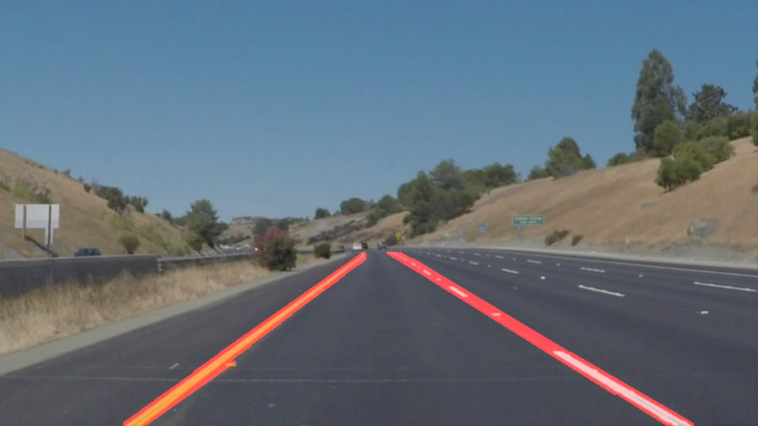
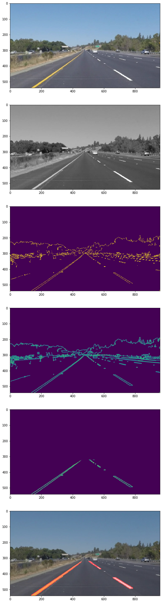

# **Finding Lane Lines on the Road** 

## Writeup

---

**Finding Lane Lines on the Road**

The goals / steps of this project are the following:
* Make a pipeline that finds lane lines on the road
* Reflect on my work in a written report

[//]: # (Image References)

---

### Reflection

### 1. Describe your pipeline. As part of the description, explain how you modified the draw_lines() function.

My pipeline consisted of 5 steps, with roughly the following parameters for the first exercise: 
* Convert to Grayscale
* Canny Edge Detection (thresholds 70 and 210 in 1/3 ratio)
* Blur (kernel size 5)
* ROI (vertical midpoint around 320)
* Hough Lines (rho = 2, threshold 100 lines, min_line_len and max_line_gap 10

In order to draw a single line on the left and right lanes, I modified the draw_lines() function by using linear regression (classic numpy polyfit of first order) after characterising hough lines by their respective slopes, and rejecting absurd slopes. Two best fit line slopes and intercepts were found and I've plugged in the vertical midpoint and the edge of the image as y values using the formula `y = mx + b` and respectively `x = (y - b) / m` to figure out the xs of the best fit lines. Finally I draw only two lines (and an extra 2 guidelines (blue) for ROI which can be quickly turned off.

If you'd like to include images to show how the pipeline works, here is how to include an image: 

Added a minimum set of two points (ROI edge based) in case detection yields nothing or too few points - should help with no lines are detected.

### 2. Identify potential shortcomings with your current pipeline

Shortcomings in the following categories:

General shortcoming: need to handpick certain pipeline parameters (including ROI, canny edge thresholds, hough) according to situation. A well-drawn line on black or dark pavement works. If the road is excessively curved, or yellowish, or the camera pointed in the wrong way, the whole procedure fails. Therefore I have used a dtection function for each type of road, as you will see, including the challenge.

Canny: Thresholds: general problems of thresholding approaches still apply. A threshold set too high can miss important information. On the other hand, a threshold set too low will falsely identify irrelevant information (such as noise) as important. It is difficult to give a generic threshold that works well on all images. No tried and tested approach to this problem yet exists accordign to literature.

ROI: vertices determined based on the 540x960 resolution. This is not trivial to modify since camera angles and road curvature (on all axes) heavily modify this.

Threshold for final challenge should be bigger - hard to distinguish from pavement. This hsould be clearly visible in the challenge vide I've generated where a section f the bidge is yellower and the detection goes haywire. 

Road curvature messes up with the Hough line detection.

### 3. Suggest possible improvements to your pipeline

The problem is that there is no size fits all here and the parameters should be adaptive. A NN or another evaluation algorithm should be used (such as an algorithm which runs all these functions I've written with certain parameters in parallel and counts the detections of each and switches dynamically, or according to other data such as RADAR, time of day, GPS location which gives road quality, etc).

Thresholding is insufficient in the challenge also. I have attempted to filter out the road (by using RGB to HSL transformations) but ran out of time and OpenCV in Python does not implement proper RGB to HSL transforms, leaving only RGV to HSV transforms. This would make the yellow of the line stand out and a masking filter could be applied. Some code is left in the comments, but the company deadline is murderous (1 day for the entire project). 

Another possible improvement would be with the line detection algorithm in curves. I've noticed there is no Hough generic algorithm in OpenCV even though Hough suggested one 50 years ago. OpenCV is seriously lacking in this regard. It would use parabolic or sinusoidal detection instead of `mx+b` style detection. There is a HoughCircles which could be used instead but I haven't had time to do this. Some form of polyfit of second degree would be helpful too, or a RANSAC (triple point circle definition).

Using NN for dynamically adjusting parameters would help a lot. Also, image segmentation would aid in discerning what is NOT a line on the road by separating vehicles, road surface and the sky. Running an image segmentation and a YOLO first before this would help a lot, and using those detections as masks in addition to an ROI.

An additional set of points for the ROI would help, basically subtracting an inner trapezoid from the outer one.
